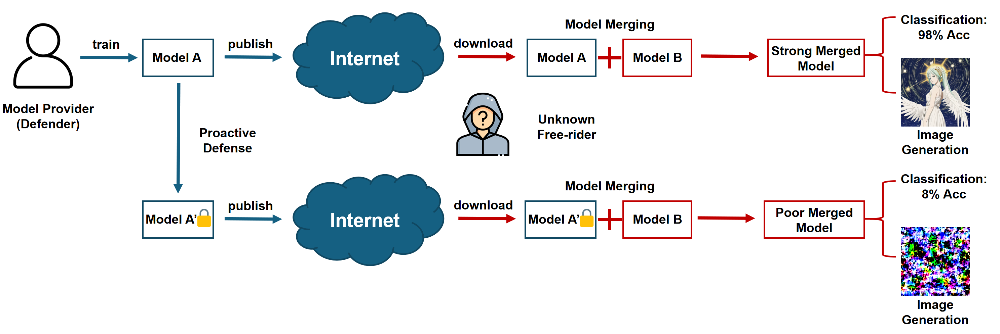

# PaRaMS
The repository of "Disrupting Model Merging: A Parameter-Level Defense Without Sacrificing Accuracy".

---

## Datasets & Checkpoints

Refer to dataset processing in the [Task Vector](https://github.com/mlfoundations/task_vectors).

---

## Acknowledgement

Implementation references are shown below. Thanks to all of them.

- [Task Arithmetic](https://github.com/mlfoundations/task_vectors)
- [TIES-Merging]( https://github.com/prateeky2806/ties-merging/tree/main)
- [AdaMerging](https://github.com/EnnengYang/AdaMerging)
- [DARE](https://github.com/yule-BUAA/MergeLM)